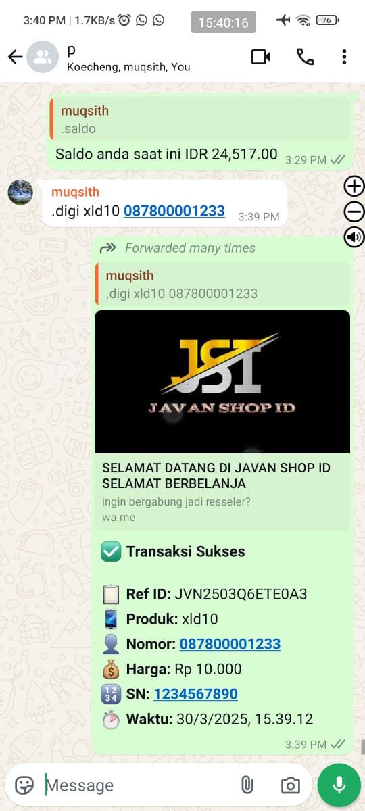

# Bot Digi - DigiFlazz Transaction Bot



<div align="center">

[](https://nodejs.org/)
[](https://bun.sh/)
[](https://www.docker.com/)
[](https://www.whatsapp.com/)
[](https://developer.digiflazz.com/)

**[🇮🇩 Bahasa Indonesia](README.md)** | **[🇬🇧 English](README.en.md)**

</div>

---

## Description

Bot Digi is a WhatsApp-based transaction bot integrated with the DigiFlazz API for seamless digital product transactions. This bot enables users to purchase various digital products such as mobile credits, data packages, game vouchers, and bill payments directly through WhatsApp.

## Key Features

| Feature                          | Description                                                                     |
| -------------------------------- | ------------------------------------------------------------------------------- |
| **Digital Product Transactions** | Purchase mobile credits, data packages, game vouchers, electricity tokens, etc. |
| **Balance Check**                | View DigiFlazz account balance in real-time                                     |
| **Deposit**                      | Top up DigiFlazz balance directly from WhatsApp                                 |
| **Webhook Callback**             | Automatic transaction status notifications                                      |
| **Owner Authentication**         | Only owners can perform transactions                                            |
| **Auto Reconnect**               | Automatic reconnection if disconnected                                          |
| **QR Code Login**                | Easy login by scanning QR code                                                  |

## System Requirements

- **Node.js** >= 18.x or **Bun** >= 1.x
- **Docker** & **Docker Compose** (optional, for deployment)
- **DigiFlazz** account with API Key
- Active **WhatsApp** number

## Installation

### Method 1: Manual Installation (Node.js/Bun)

1. **Clone repository**

   ```bash
   git clone https://github.com/indonumberone/botwa-digiflazz.git
   cd botwa-digiflazz
   ```

2. **Install dependencies**

   ```bash
   # Using npm
   npm install

   # Or using Bun
   bun install
   ```

3. **Configure environment variables**

   Create `.env` file in root directory:

   ```env
   # DigiFlazz Configuration
   DIGIFLAZZ_API_KEY=your_digiflazz_api_key
   DIGIFLAZZ_SECRET_KEY=your_digiflazz_secret_key
   DIGIFLAZZ_BASE_URL=https://api.digiflazz.com/
   USERNAME_DIGIFLAZZ=your_digiflazz_username

   # Owner Configuration
   OWNER_NUMBER=6281234567890@s.whatsapp.net
   OWNER_NAME=Your Name

   # App Configuration
   PORT=3030
   ```

4. **Run the bot**

   ```bash
   # Using npm
   npm start

   # Or using Bun
   bun run src/index.js
   ```

5. **Scan QR Code**
   - QR Code will appear in terminal
   - Open WhatsApp > Linked Devices > Link a Device
   - Scan the QR Code displayed

### Method 2: Using Docker (Recommended for Production)

1. **Clone repository**

   ```bash
   git clone https://github.com/indonumberone/botwa-digiflazz.git
   cd botwa-digiflazz
   ```

2. **Configure environment variables**

   Create `.env` file as shown in Method 1

3. **Run with Docker Compose**

   ```bash
   # Production
   docker compose up -d

   # Development (with hot reload)
   docker compose -f docker-compose.dev.yml up -d
   ```

4. **View logs for QR Code**
   ```bash
   docker logs -f botwa-digiflazz
   ```

## Bot Commands

| Command                | Description              | Example                  |
| ---------------------- | ------------------------ | ------------------------ |
| `/buy` or `/digi`      | Make product transaction | `/buy xl10 081234567890` |
| `/saldo` or `/balance` | Check DigiFlazz balance  | `/saldo`                 |
| `/deposit`             | Request deposit          | `/deposit 100000`        |

> **Note**: All commands can only be used by registered owners.

## DigiFlazz Webhook Configuration

To receive transaction status callbacks, setup webhook in DigiFlazz dashboard:

1. Login to [DigiFlazz Dashboard](https://member.digiflazz.com/)
2. Go to **Connection Settings** > **API** > **Webhook**
3. Enter callback URL: `https://yourdomain.com/webhookdigi`
4. Enter the same Secret Key as `DIGIFLAZZ_SECRET_KEY` in `.env`

## Directory Structure

```
botwa-digiflazz/
├── src/
│   ├── index.js          # Application entry point
│   ├── handler.js        # WhatsApp message handler
│   ├── lib/
│   │   ├── callbackHandler.js  # DigiFlazz webhook handler
│   │   ├── createTRX.js        # DigiFlazz transaction functions
│   │   ├── messageHandle.js    # Message reply functions
│   │   └── makeid.js           # Transaction ID generator
│   ├── utils/
│   │   ├── digiflazz.js        # DigiFlazz config
│   │   ├── owner.js            # Owner config
│   │   └── parseResMessage.js  # Response parser
│   └── login/                  # WhatsApp session (auto-generated)
├── logs/                       # Log files
├── docker-compose.yml          # Docker production config
├── docker-compose.dev.yml      # Docker development config
├── Dockerfile
├── package.json
└── .env                        # Environment variables
```

## License

ISC License

## Contributing

Contributions, issues, and feature requests are welcome!

## Need a Place to Run the Bot or Setup? Contact

- Email: [ 01muqsith@gmail.com ]
- GitHub: [indonumberone](https://github.com/indonumberone)

## Premium Features Please Contact Owner
