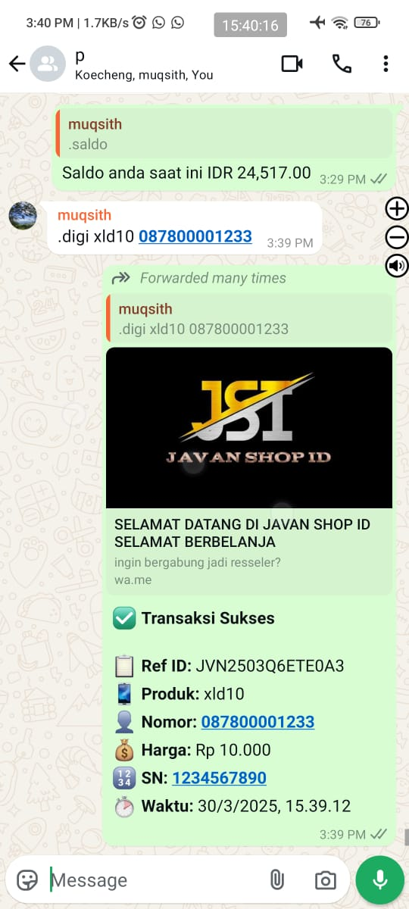

# Bot Digi - DigiFlazz Transaction Bot



<div align="center">

[](https://nodejs.org/)
[](https://bun.sh/)
[](https://www.docker.com/)
[](https://www.whatsapp.com/)
[](https://developer.digiflazz.com/)

**[🇮🇩 Bahasa Indonesia](README.md)** | **[🇬🇧 English](README.en.md)**

</div>

---

## Deskripsi

Bot Digi merupakan bot transaksi berbasis WhatsApp yang terintegrasi dengan API DigiFlazz untuk transaksi produk digital yang lancar. Bot ini memungkinkan pengguna untuk membeli berbagai produk digital seperti pulsa seluler, paket data, voucher game, dan pembayaran tagihan langsung melalui WhatsApp.

## Fitur Utama

| Fitur                        | Deskripsi                                                     |
| ---------------------------- | ------------------------------------------------------------- |
| **Transaksi Produk Digital** | Pembelian pulsa, paket data, voucher game, token listrik, dll |
| **Cek Saldo**                | Melihat saldo akun DigiFlazz secara real-time                 |
| **Deposit**                  | Melakukan top-up saldo DigiFlazz langsung dari WhatsApp       |
| **Webhook Callback**         | Notifikasi otomatis status transaksi                          |
| **Autentikasi Owner**        | Hanya owner yang dapat melakukan transaksi                    |
| **Auto Reconnect**           | Reconnect otomatis jika koneksi terputus                      |
| **QR Code Login**            | Login mudah dengan scan QR code                               |

## Persyaratan Sistem

- **Node.js** >= 18.x atau **Bun** >= 1.x
- **Docker** & **Docker Compose** (opsional, untuk deployment)
- Akun **DigiFlazz** dengan API Key
- Nomor **WhatsApp** aktif

## Instalasi

### Metode 1: Instalasi Manual (Node.js/Bun)

1. **Clone repository**

   ```bash
   git clone https://github.com/indonumberone/botwa-digiflazz.git
   cd botwa-digiflazz
   ```

2. **Install dependencies**

   ```bash
   # Menggunakan npm
   npm install

   # Atau menggunakan Bun
   bun install
   ```

3. **Konfigurasi environment variables**

   Buat file `.env` di root direktori:

   ```env
   # DigiFlazz Configuration
   DIGIFLAZZ_API_KEY=your_digiflazz_api_key
   DIGIFLAZZ_SECRET_KEY=your_digiflazz_secret_key
   DIGIFLAZZ_BASE_URL=https://api.digiflazz.com/
   USERNAME_DIGIFLAZZ=your_digiflazz_username

   # Owner Configuration
   OWNER_NUMBER=6281234567890@s.whatsapp.net
   OWNER_NAME=Your Name

   # App Configuration
   PORT=3030
   ```

4. **Jalankan bot**

   ```bash
   # Menggunakan npm
   npm start

   # Atau menggunakan Bun
   bun run src/index.js
   ```

5. **Scan QR Code**
   - QR Code akan muncul di terminal
   - Buka WhatsApp > Perangkat Tertaut > Tautkan Perangkat
   - Scan QR Code yang muncul

### Metode 2: Menggunakan Docker (Rekomendasi untuk Production)

1. **Clone repository**

   ```bash
   git clone https://github.com/indonumberone/botwa-digiflazz.git
   cd botwa-digiflazz
   ```

2. **Konfigurasi environment variables**

   Buat file `.env` seperti pada Metode 1

3. **Jalankan dengan Docker Compose**

   ```bash
   # Production
   docker compose up -d

   # Development (dengan hot reload)
   docker compose -f docker-compose.dev.yml up -d
   ```

4. **Lihat logs untuk QR Code**
   ```bash
   docker logs -f botwa-digiflazz
   ```

## Perintah Bot

| Perintah                 | Deskripsi                  | Contoh                   |
| ------------------------ | -------------------------- | ------------------------ |
| `/buy` atau `/digi`      | Melakukan transaksi produk | `/buy xl10 081234567890` |
| `/saldo` atau `/balance` | Cek saldo DigiFlazz        | `/saldo`                 |
| `/deposit`               | Request deposit            | `/deposit 100000`        |

> **Catatan**: Semua perintah hanya dapat digunakan oleh owner yang terdaftar.

## Konfigurasi Webhook DigiFlazz

Untuk menerima callback status transaksi, setup webhook di dashboard DigiFlazz:

1. Login ke [Dashboard DigiFlazz](https://member.digiflazz.com/)
2. Buka menu **Atur Koneksi** > **API** > **Webhook**
3. Masukkan URL callback: `https://yourdomain.com/webhookdigi`
4. Masukkan Secret Key yang sama dengan `DIGIFLAZZ_SECRET_KEY` di `.env`

## Struktur Direktori

```
botwa-digiflazz/
├── src/
│   ├── index.js          # Entry point aplikasi
│   ├── handler.js        # Handler pesan WhatsApp
│   ├── lib/
│   │   ├── callbackHandler.js  # Handler webhook DigiFlazz
│   │   ├── createTRX.js        # Fungsi transaksi DigiFlazz
│   │   ├── messageHandle.js    # Fungsi reply pesan
│   │   └── makeid.js           # Generator ID transaksi
│   ├── utils/
│   │   ├── digiflazz.js        # Config DigiFlazz
│   │   ├── owner.js            # Config Owner
│   │   └── parseResMessage.js  # Parser response
│   └── login/                  # Session WhatsApp (auto-generated)
├── logs/                       # Log files
├── docker-compose.yml          # Docker production config
├── docker-compose.dev.yml      # Docker development config
├── Dockerfile
├── package.json
└── .env                        # Environment variables
```

## Lisensi

ISC License

## Kontribusi

Kontribusi, issue, dan permintaan fitur sangat diterima!

## Butuh Tempat Running bot atau setup? Hubungi

- Email: [ 01muqsith@gmail.com ]
- GitHub: [indonumberone](https://github.com/indonumberone)

## Premium Fitur Please Contact Owner
